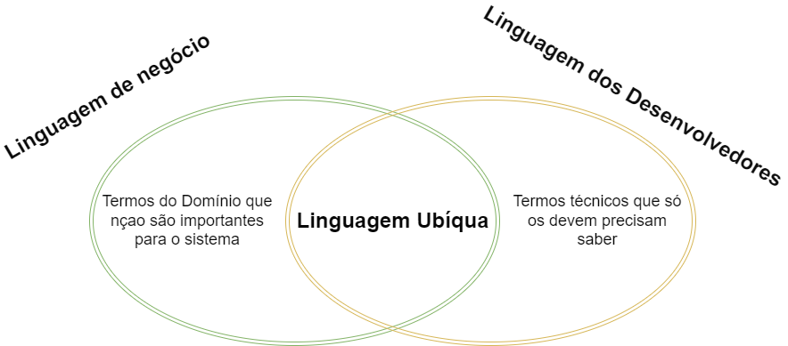

<style>
  /*highlight*/
  .hl { 
    color: lightyellow;
    font-weight: bold
  }
</style>
# Sumário

<!--  -->
- Introdução
- Linguagem Ubíqua
  > Um dos pilares do DDD
- Domínios ricos
  >  Quando devemos optar por Dominios ricos. Quando devemos optar por Domínios anêmicos
- Sub Domínios
  > Importante para organizar seu sistema segmentando a solução em problemas menores
- Separação em Contextos Delimitados
- Organizando a solução
- Definindo as entidades
- Corrupção no código
  > POOs (Princípios de Orientação de Objeto) utilizados para garantir que outros Devs que possam utilizar o seu código não possam fazer coisas erradas.
- SOLID e Clean Code
  > Princípios bastante importantes e utilizados pelo mercado
- Primitive Obsession
- Value Objects (VO)
- Compartilhando informações entre Contextos Delimitados
  > Técnicas de compartilhamento de informação
- Testando as Entidades de VOs (Value Objects)
- Commands
- Fail Fast Validations
- Testando os Commands
- Repository Pattern
- Handlers
- Testando os Handlers
- Queries
- Testando suas Queries

# Linguagem Ubíqua
> Em cada empresa vão existir conceitos, abreviaturas, jargões, etc.

"Linguagem Ubíqua (ou Linguagem Onipresente) é um conceito central de DDD. Ela consiste de <span class="hl">um conjunto de termos que devem ser plenamente entendidos tanto por especialistas no domínio (usuários do sistema) como por desenvolvedores (implementadores do sistema)".</span>

"Para um projeto de software dar certo, DDD defende que esses dois papéis – especialistas no domínio e desenvolvedores – <span class="hl">devem falar a mesma língua</span>, que vai constituir a chamada Linguagem Ubíqua do sistema".

  
- Referência: https://engsoftmoderna.info/artigos/ddd.html#:~:text=1.2%20Linguagem%20Ub%C3%ADqua,desenvolvedores%20(implementadores%20do%20sistema).

A Linguagem Ubíqua tem que tratar de nivelar esses termos antes mesmo de iniciar um sistema. Em resumo, trata-se de que todos estão conversando na mesma linguagem, se entendendo.  

Falar a linguagem do cliente é <span class="hl"> fundamental. </span>

# Domínios Ricos VS Domínios Anêmicos

É muito comum encontrar domínios como esse abaixo:

```cs
public class User {
  public string Name { get; set; }
  public int Age { get; set; }
}
```

Esses tipos de domínio são chamados de "Domínios Anêmicos". Esses domínios não tem especifidade. Em um domínio anêmico você tem somente as propriedades e elas reflete o que está no banco de dados. 

> **Q.** Mas está errado desenvolver domínios anêmicos?  
  **Não**, é só uma abordagem diferente

Geralmente para realizar essas operações são realizados Storage Procesures no banco que realizam essas operações. O lado ruim dessa abordagem é não poder testar uma SP. Outro ponto está na utilização de uma POO rica que pode identificar erros em tempo de compilação. Nesse sentido o MER é muito inferior ao POO. 

> **Q.** Isso significa que não devo utilizar SP?
  **Pode sim**. O que você não pode fazer e tomar decisões dentro das SP, tipo um **if**, pois você está segmentando um teste. Cada condição precisa ser um teste. Isso se chama complexidade ciclomática.

Em um Domínio Rico o banco de dados acaba se tornando um repositório de informações, não existindo nele nenhuma regra de negócio, servidno somente para armazenar dados, somente.

Nesse cenário você percebe m ganho muito grande de performance e pode compreender em sua solução a utilização de bancos de dados não relacionais (NoSQL) que agora começa a fazer mais sentido. Em um banco relacional toda a vez que você vai fazer um INSERT ele vai verificar as suas relações e dependências de outras tabelas no banco, fazendo um DELETE ele vai verificar se o registro vai ficar órfão no banco, vai executar as primarys keys, as foreigt keys. Em um banco NoSQL ele vai pegar suas informações e jogar em um JSON. Logo você consegue um tempo de leitura e escrita muito superior. <span class="hl"> Os bancos NoSQL não fazem esse tipo de validação, por isso a sua aplicação tem que garantir isso.</span> Mas com a utilização de um Modelo Rico essas validações já são feitas nessas entidades.

Um exemplo de site que usa um domínio anêmico é o balta.io. Ele é um Node acessando o MongoDB pois ele não possui regras de negócio. Ou você é aluno e tem acesso aos cursos ou você não é aluno, simples assim. <span class="hl">Usar um Modelo Rico nesse sentido seria utilizar um canhão para matar um mosquito.</span>

# Sub Domínios
É muito dificil você modelar e desenvolver um sistema grande sem ter que quebrar ele em partes, em partes menores, ou seja, em sub domínios. 

É muito 

